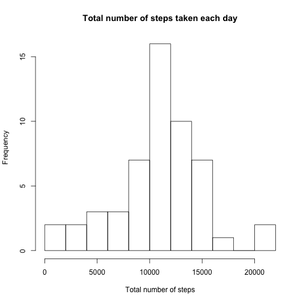
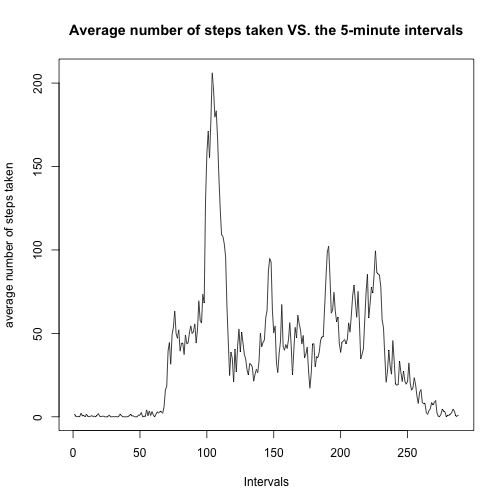
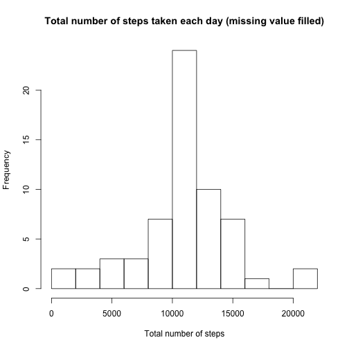
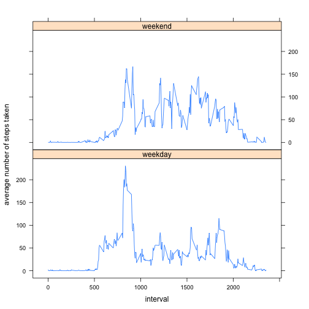

## Loading and preprocessing the data

```r
## load the data and convert it to a data frame with date as POSIXlt format
activity <- read.csv("./activity.csv")
dates_ch <- activity$date
dates <- strptime(dates_ch,"%Y-%m-%d")
activity <- transform(activity, date=dates)
```

## What is mean total number of steps taken per day?

```r
## calculate the total number of steps taken per day and plot a histogram
TotalStepByDate <- tapply(activity$steps, dates_ch, sum)
hist(TotalStepByDate, nclass = 10, main = "Total number of steps taken each day", xlab = "Total number of steps")
```

 

```r
## calculate and print out mean and median of total number of steps taken per day
MeanTotalStepByDate <- mean(TotalStepByDate,na.rm=TRUE)
paste("Mean number of steps taken each day is",MeanTotalStepByDate)
```

```
## [1] "Mean number of steps taken each day is 10766.1886792453"
```

```r
MedianTotalStepByDate <- median(TotalStepByDate,na.rm=TRUE)
paste("Median number of steps taken each day is",MedianTotalStepByDate)
```

```
## [1] "Median number of steps taken each day is 10765"
```

## What is the average daily activity pattern?

```r
## calculate and plot the average steps by interval across all the days
AverageStepByInterval <- tapply(activity$steps, activity$interval, FUN=function(x)mean(x,na.rm=TRUE))
plot(AverageStepByInterval,type="l",main = "Average number of steps taken VS. the 5-minute intervals", xlab = "Intervals", ylab = "average number of steps taken" )
```

 

```r
## calculate and print the interval with the maximum mean number of steps across all the days
Interval = factor(activity$interval)
IntervalMaxStep <- Interval[which(AverageStepByInterval==max(AverageStepByInterval,na.rm=TRUE))]
paste("The interval with the maximum mean number of steps is",IntervalMaxStep)
```

```
## [1] "The interval with the maximum mean number of steps is 835"
```

## Imputing missing values

```r
## locate the index of all the rows with missing values
IndexNA <- which(is.na(activity$steps))

## create a new data frame based on the original date frame with all the missing values filled with the interval mean averaged across all the days
activityNew <- activity
for(i in IndexNA){
  activityNew$steps[i] <- AverageStepByInterval[[as.character(activity$interval[i])]]
}

## calculate the new total number of steps taken per day and plot a new histogram with new data frame
TotalStepByDateNew <- tapply(activityNew$steps, dates_ch, sum)
hist(TotalStepByDateNew, nclass = 10, main = "Total number of steps taken each day (missing value filled)", xlab = "Total number of steps")
```

 

```r
## calculate and print out new mean and median of total number of steps taken per day
MeanTotalStepByDateNew <- mean(TotalStepByDateNew,na.rm=TRUE)
MedianTotalStepByDateNew <- median(TotalStepByDateNew,na.rm=TRUE)
```

## Are there differences in activity patterns between weekdays and weekends?

```r
library(lattice)
library(knitr)

## factorize the weekday/weekend based on the weekdays information and plug it as a new variable into the newly filled data frame
weekday = factor(weekdays(activityNew$date))
levels(weekday) <- list(weekday=c("Monday", "Tuesday", "Wednesday", "Thursday", "Friday"), weekend=c("Saturday", "Sunday"))
activityNew <- transform(activityNew, weekday = weekday)

## calculate the average step number of each interval across all the weekdays or weekends
activityWeekday <- activityNew[activityNew$weekday=="weekday",]
activityWeekend <- activityNew[activityNew$weekday=="weekend",]
AverageStepByIntervalWeekday <- tapply(activityWeekday$steps, activityWeekday$interval, FUN=function(x)mean(x,na.rm=TRUE))
AverageStepByIntervalWeekday <- cbind(read.table(text=names(AverageStepByIntervalWeekday)),AverageStepByIntervalWeekday, rep("weekday",dim(AverageStepByIntervalWeekday)))
names(AverageStepByIntervalWeekday) <- c("interval","NumberOfSteps","weekday")
AverageStepByIntervalWeekend <- tapply(activityWeekend$steps, activityWeekend$interval, FUN=function(x)mean(x,na.rm=TRUE))
AverageStepByIntervalWeekend <- cbind(read.table(text=names(AverageStepByIntervalWeekend)),AverageStepByIntervalWeekend, rep("weekend",dim(AverageStepByIntervalWeekend)))
names(AverageStepByIntervalWeekend) <- c("interval","NumberOfSteps","weekday")
AverageStepByIntervalwkd <- rbind(AverageStepByIntervalWeekday,AverageStepByIntervalWeekend)

## explicitely answer if there are differences between weekdays and weekends
print("Are there differences in activity patterns between weekdays and weekends?:")
```

```
## [1] "Are there differences in activity patterns between weekdays and weekends?:"
```

```r
if(identical(AverageStepByIntervalWeekday,AverageStepByIntervalWeekend)){
  print("No, there aren't.")
}else{
  print("Yes, there are.")
}
```

```
## [1] "Yes, there are."
```

```r
## plot the average step number of each interval across all the weekdays or weekends
xyplot(NumberOfSteps ~ interval| weekday, data=AverageStepByIntervalwkd, ylab = "average number of steps taken", layout = c(1,2),type="l")
```

 
