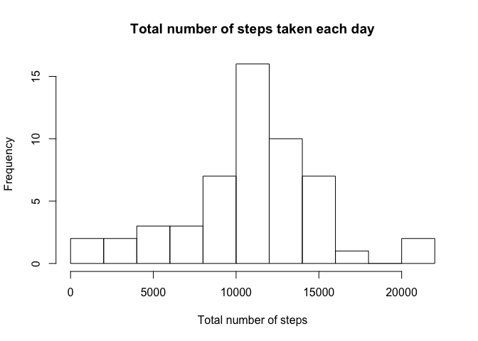
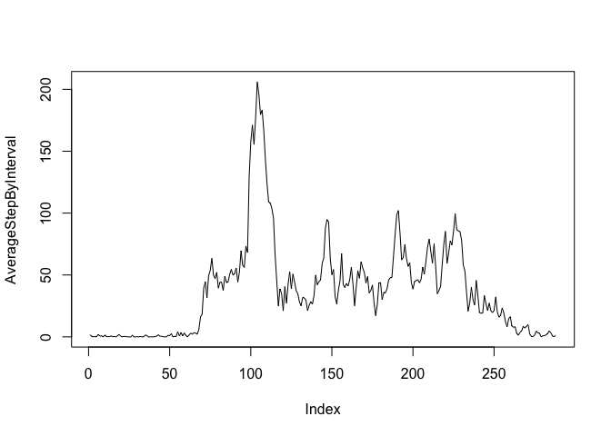
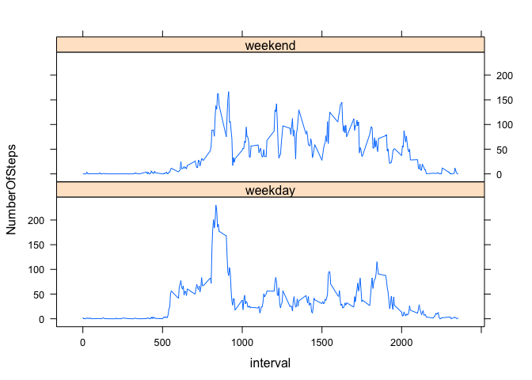

# Reproducible Research: Peer Assessment 1


## Loading and preprocessing the data

```r
activity <- read.csv("./activity.csv")
dates_ch <- activity$date
dates <- strptime(dates_ch,"%Y-%m-%d")
activity <- transform(activity, date=dates)
```

## What is mean total number of steps taken per day?

```r
TotalStepByDate <- tapply(activity$steps, dates_ch, sum)
hist(TotalStepByDate, nclass = 10, main = "Total number of steps taken each day", xlab = "Total number of steps")
```

 

```r
MeanTotalStepByDate <- mean(TotalStepByDate,na.rm=TRUE)
MedianTotalStepByDate <- median(TotalStepByDate,na.rm=TRUE)
```

## What is the average daily activity pattern?


```r
AverageStepByInterval <- tapply(activity$steps, activity$interval, FUN=function(x)mean(x,na.rm=TRUE))
plot(AverageStepByInterval,type="l")
```

 

```r
Interval = factor(activity$interval)
IntervalMaxStep <- Interval[which(AverageStepByInterval==max(AverageStepByInterval,na.rm=TRUE))]
```

## Imputing missing values

```r
NumNA <- sum(is.na(activity))
IndexNA <- which(is.na(activity$steps))
activityNew <- activity
for(i in IndexNA){
  activityNew$steps[i] <- AverageStepByInterval[[as.character(activity$interval[i])]]
}

TotalStepByDateNew <- tapply(activityNew$steps, dates_ch, sum)
MeanTotalStepByDateNew <- mean(TotalStepByDateNew,na.rm=TRUE)
MedianTotalStepByDateNew <- median(TotalStepByDateNew,na.rm=TRUE)
```

## Are there differences in activity patterns between weekdays and weekends?

```r
library(lattice)
weekday = factor(weekdays(activityNew$date))
levels(weekday) <- list(weekday=c("Monday", "Tuesday", "Wednesday", "Thursday", "Friday"), weekend=c("Saturday", "Sunday"))
activityNew <- transform(activityNew, weekday = weekday)

activityWeekday <- activityNew[activityNew$weekday=="weekday",]
activityWeekend <- activityNew[activityNew$weekday=="weekend",]

AverageStepByIntervalWeekday <- tapply(activityWeekday$steps, activityWeekday$interval, FUN=function(x)mean(x,na.rm=TRUE))
## plot(AverageStepByIntervalWeekday,type="l")
AverageStepByIntervalWeekday <- cbind(read.table(text=names(AverageStepByIntervalWeekday)),AverageStepByIntervalWeekday, rep("weekday",dim(AverageStepByIntervalWeekday)))
names(AverageStepByIntervalWeekday) <- c("interval","NumberOfSteps","weekday")

AverageStepByIntervalWeekend <- tapply(activityWeekend$steps, activityWeekend$interval, FUN=function(x)mean(x,na.rm=TRUE))
## plot(AverageStepByIntervalWeekend,type="l")
AverageStepByIntervalWeekend <- cbind(read.table(text=names(AverageStepByIntervalWeekend)),AverageStepByIntervalWeekend, rep("weekend",dim(AverageStepByIntervalWeekend)))
names(AverageStepByIntervalWeekend) <- c("interval","NumberOfSteps","weekday")

AverageStepByIntervalwkd <- rbind(AverageStepByIntervalWeekday,AverageStepByIntervalWeekend)

xyplot(NumberOfSteps ~ interval| weekday, data=AverageStepByIntervalwkd, layout = c(1,2),type="l")
```

 
